# System architecture

> updated 2026-09-04 · pre-release

## Goal
Keep the heavy media path local while exposing a small server boundary for translation/provider access and entitlement state.

## Runtime topology

```mermaid
flowchart LR
    F[Local video file] --> C[Native client]
    C --> A[Local audio extraction]
    A --> I[On-device ASR / diarization / separation]
    I --> T[Transcript JSON]
    T --> B[Translation proxy]
    B --> T2[Translated segments JSON]
    T2 --> V[On-device Vietnamese TTS]
    V --> M[Local mix + duration fit]
    M --> R[Local video remux]
    R --> P[Player / offline library]
```

## Trust boundaries
- Video and audio bytes remain inside the app sandbox.
- Backend endpoints accept JSON only and explicitly reject media content types and oversized bodies.
- Translation provider credentials exist only in Worker secrets/environment bindings.
- Third-party video URL resolvers, downloaders, scraping, and CAPTCHA bypass are outside the product architecture.

## Native clients
### iOS
SwiftUI frontend. Local video import uses the system Photos Picker filtered to videos; large selected assets are transferred with a file representation and copied immediately into LingoPlay-owned cache before AVFoundation metadata inspection and local M4A audio preparation. ASR is behind a LingoPlay protocol backed by Argmax OSS/WhisperKit 1.1.0. Long audio uses WhisperKit incremental file loading, and the adapter initializes only from an Application Support model package containing the CoreML model components plus local tokenizer assets; `download` is disabled during inference setup. After ASR succeeds, `TranslationService` converts timestamped transcript segments into bounded JSON batches and calls the configured backend base URL from the generated `LingoPlayTranslationAPIBaseURL` Info.plist key. Provider credentials never exist in the app. Stage 5 uses `AVSpeechSynthesizer.write(_:toBufferCallback:)` with an installed Vietnamese system voice to persist one local CAF speech clip per translated segment. Stage 6 builds a dub stem, mixes it with the original soundtrack through explicit `AVAudioMix` volume ramps, ducks the original around translated speech, and exports a self-contained final MP4 without re-encoding the video track. Fresh in-app playback uses one `AVPlayerItem` containing video + original audio + dub stem so Original↔Dub adjustment stays on one playback clock rather than synchronizing independent players. Stage 7 copies the final MP4 plus compact translation metadata into `Application Support/LingoPlay/Library`; reopened saved items play the self-contained final mix through one AVPlayer and can be exported with the native share sheet or deleted locally.

### Android
Jetpack Compose frontend. Local video import uses `ActivityResultContracts.PickVisualMedia` filtered to `VideoOnly`, preferring the system Photo Picker and retaining its document-provider fallback on unsupported devices; LingoPlay keeps read access when the provider allows it, inspects metadata through platform media APIs, and uses `MediaExtractor` + `MediaMuxer` to copy the first supported audio track into app cache without video upload or video re-encode. ASR is backed by sherpa-onnx 1.13.7. Compressed audio is decoded locally to mono PCM and fed to the offline Whisper recognizer in bounded 25-second chunks so a long podcast does not require one full-file `FloatArray`; each returned segment currently carries the real chunk time range rather than claiming sentence-level timestamps the Kotlin wrapper does not expose. After ASR succeeds, Android sends only segment JSON through `TranslationService`; the public backend base URL is injected through the `LINGOPLAY_TRANSLATION_API_BASE_URL` Gradle property into BuildConfig, with no provider secret in the APK. Stage 5 uses platform `TextToSpeech.synthesizeToFile` and `UtteranceProgressListener`, selecting only an installed Vietnamese voice whose `isNetworkConnectionRequired` flag is false. Stage 6 no longer creates a full-duration PCM WAV: the original audio is decoded in bounded chunks, normalized/resampled when required by the AAC encoder, ducked around translated speech, mixed with TTS PCM in memory, and streamed directly into `MediaCodec` AAC. Final remux keeps the compressed video and writes video/audio samples in presentation-time order. Android playback uses one player clock on the already mixed MP4; unsafe dual-player live blending remains disabled until it can be implemented inside one playback graph. Stage 7 copies successful final MP4s plus translation metadata into app-specific Movies storage (with an internal-storage fallback), exposes them through a scoped `FileProvider` only when the user chooses Share, and supports reopen/delete without broad storage permission.

## Backend
Cloudflare Worker TypeScript with three initial routes:
- `GET /health` — liveness and media-boundary declaration.
- `POST /v1/translate` — validates timestamped segment JSON, forwards only compact transcript text/metadata to the configured provider, validates the provider's one-result-per-ID response, and returns normalized translated text.
- `GET /v1/entitlements` — returns a minimal plan/capability shape; production identity/billing verification is a later boundary.

The Worker must never accept multipart/form-data, audio/*, video/*, or opaque media blobs. Native clients batch at no more than 80 segments / 10,000 source characters per request, comfortably below the Worker limits of 240 segments / 24,000 source characters / 64 KiB body. Segment IDs are stable across the round trip; source timestamps remain client-owned and are combined with translated text locally.

## Model storage boundary
- iOS: `Application Support/LingoPlay/Models/WhisperKit/current` must contain the WhisperKit CoreML components and tokenizer data before ASR is considered installed.
- Android: `filesDir/lingoplay/models/sherpa-whisper/current` must contain encoder ONNX, decoder ONNX, and tokens text files before ASR is considered installed.
- Stage 3 never downloads a speech model implicitly. Model acquisition/selection is a separate product action because model size, network use, and storage impact are material user-visible costs.

## Current stage
Stages 1–7.1 implementation is wired on both native clients: local media ingestion, audio preparation, on-device ASR, transcript-only translation, local Vietnamese TTS/duration fitting, production-safe local soundtrack mixing/remux, real playback, branded launcher/native launch surfaces, durable local-library persistence, reopen, native share/export, and local deletion. Home and Library are backed by real saved outputs rather than demo rows; saved Library items are always offline-capable, so the redundant standalone Offline destination was removed in Stage 7.1. Final exported media preserves the original soundtrack/BGM/SFX and ducks it around Vietnamese speech instead of replacing it with a silent-gap dub track. Android Stage 6 has representative MEIZU Lucky 08 physical codec evidence; a broader Android OEM matrix and iOS physical-hardware runtime matrix remain desirable production evidence, not fabricated closure claims.
